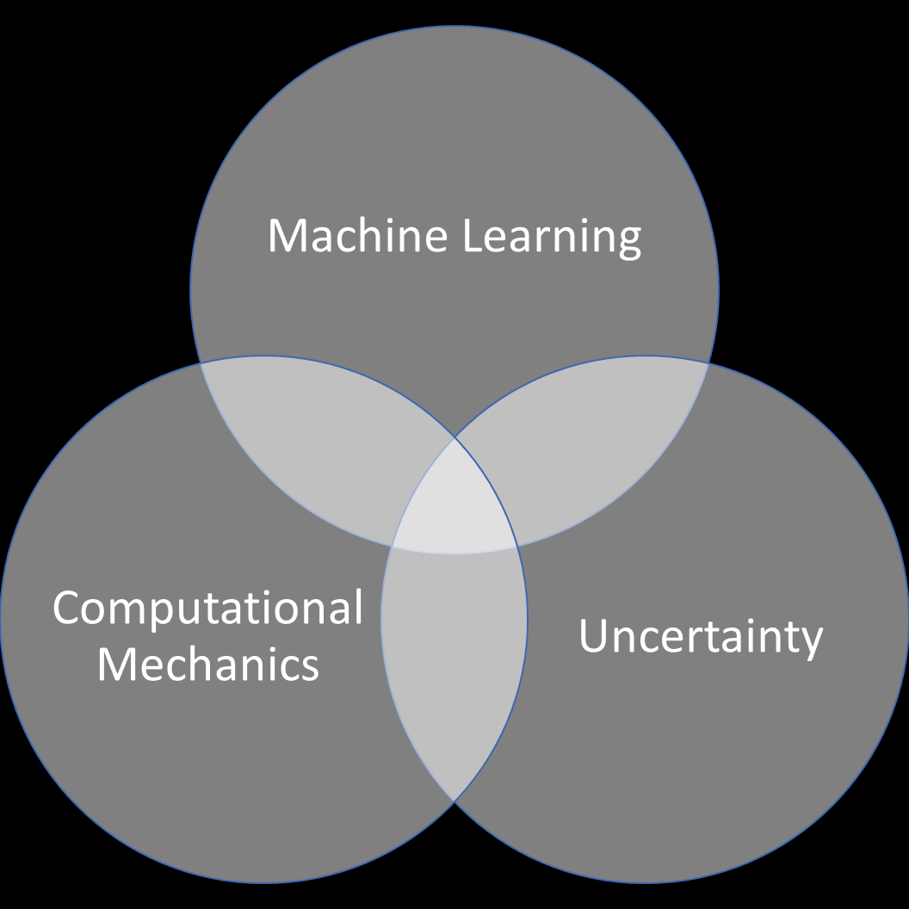

#### 
 *I have approximate answers and possible beliefs in different degrees of certainty about different things, but I'm not absolutely sure of anything. ~ Richard Feynman*

# 
 Hi, I'm Debrup Sarkar 👋

 I'm a Master's student passionate about probabilistic machine learning algorithms and their applications in science and engineering .My research primarily focuses on applying machine learning techniques to discover material models and constitutive laws. 

  <!-- One line space here -->

🎓 Currently pursuing my Master's degree in **Applied Mechanics** at the **Indian Institute of Technology, Delhi**

🔍 Research Interests: Computational Mechanics, Probabilistic Machine Learning, Scientific Machine Learning

💻 I enjoy exploring the intersection of **machine learning and computational mechanics**

  

📧 Feel free to reach out to me at sarkardebrup.mech@gmail.com

I'm familier to

Languages: 

Machine Learning Framework: 

Visualization: 

Miscellaneous:

Operating systems: 

  <!-- One line space here -->
  <!-- One line space here -->

Connect me at: 

